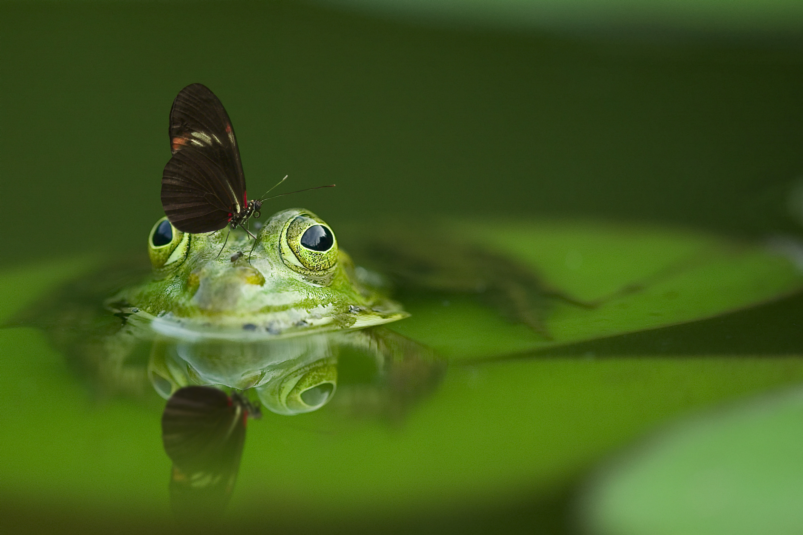

### Hello, and welcome to this blog!

Here, you will find blog posts about quantum chemistry, data science, mathematics, programming, and more! Not necessarily separated by topics, though.

 
Note that I'm a chemist, so my projects will most probably be pointed towards that direction (which I hope you'll find cool!)
 
